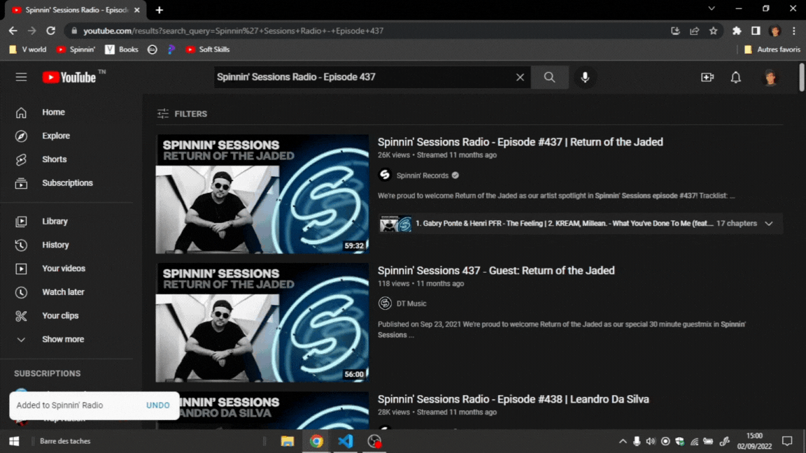

# Spinning Records Playlist Automator 🎵🚗

## About
As a huge fan of Spinning Records' epic 1-hour radio sessions, I wanted to enjoy episodes 1 to 500 on my car's old-school CD player. Manually adding each episode to a YouTube playlist for downloading via a website was way too tedious. So, I built this **PyAutoGUI** script to automate the process, saving hours of repetitive clicking! 🎉 This project showcases my automation solution for adding Spinning Records episodes to a private YouTube playlist with just a few lines of code.

## The Problem 🤦‍♂️
To download Spinning Records episodes, I used a website that grabs videos from a YouTube playlist URL in one click. But adding 500 episodes to a playlist manually? No thanks! Searching for each episode, clicking "Add to Playlist," and repeating 500 times was a nightmare. I needed a smarter way.

## The Solution 💡
I created `main.py`, a Python script using PyAutoGUI to automate:
- Searching for "Spinning Records Episode X" on YouTube.
- Clicking the "Add to Playlist" button to add each video to my private playlist.
- Looping through episodes 1 to 500.

The result? A fully populated playlist ready for downloading, with zero manual effort! 😎 Check out `demo.gif` to see it in action.

## How It Works 🛠️
- **PyAutoGUI**: Simulates mouse clicks to interact with YouTube's search bar and "Add to Playlist" button.
- **Automation Flow**:
  1. Open YouTube in a browser.
  2. Script types the episode name (e.g., "Spinning Records Episode 1").
  3. Clicks the search button, finds the video, and adds it to the playlist.
  4. Repeats for all episodes (1 to 500).
- **Customization**: Screen coordinates for the search bar and buttons are set in `main.py`.

## Demo 🎬
Watch the automation magic happen:  


## Tech Stack 🧑‍💻
- **Python 3.x**
- **PyAutoGUI**: For mouse and keyboard automation.
- A YouTube account with a private playlist.

## Setup ⚙️
1. Clone the repo:
   ```bash
   git clone https://github.com/yourusername/spinning-records-playlist-automator.git
   ```
2. Install PyAutoGUI:
   ```bash
   pip install pyautogui
   ```
3. Update `main.py` with your screen coordinates for YouTube's interface.

## Running the Script 🚀
1. Log in to YouTube and open your browser.
2. Run:
   ```bash
   python main.py
   ```
3. Watch as your playlist fills up with Spinning Records episodes! 🎧

## Why I Built This 🌟
This project was born out of my love for Spinning Records and the need to make my car's music setup effortless. It’s a fun example of how automation can solve real-world problems, even niche ones like mine! 😄

## License 📜
MIT License. See [LICENSE](LICENSE) for details.

## Final Note 🎶
This project was a labor of love to bring Spinning Records to my car rides. Hope you enjoy seeing how I turned a repetitive task into a slick automated solution! 🚗💿